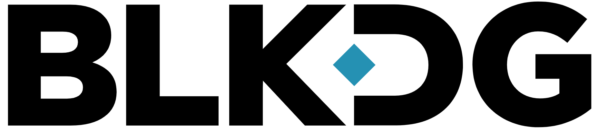
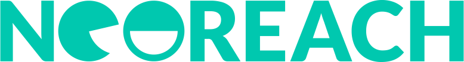
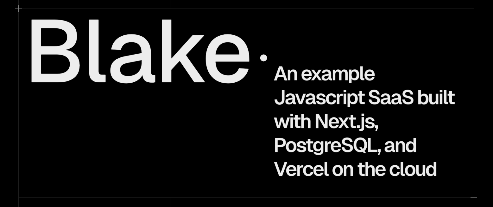

<h1 style="margin-top:0;font-size:56px;">Hi, I'm Alex </h1>

    <ul style="padding-left: 1.5em;line-height:38px; font-size:24px;list-style-type:'👉  ';">
      <li>
        I've worked <b>12+</b> years as a <b>Full Stack Software Engineer</b>, specializing in:
        <ul style="padding-top:.25em;padding-bottom:.25em;">
          <li>Typescript</li> 
          <li>React.js</li> 
          <li>Node.js</li> 
          <li>SQL/NoSQL</li>
        </ul>
      </li>
      <li><b>Team Lead</b> and <b>Senior</b> for multiple teams.</li>
      <li><b>Proven</b> experience in building apps for the web, from concept to deployment.</li>
    </ul>

  Some companies I've worked for include:

  
  
  
  

<h1 style="margin-top:1em; font-size: 42px;font-weight:bold; background: linear-gradient(to right, #ef5350, #f48fb1, #7e57c2, #2196f3, #26c6da, #43a047, #eeff41, #f9a825, #ff5722); -webkit-background-clip: text; -webkit-text-fill-color: transparent;">
  <a href="https://linkedin.com/in/alexanderlperez" target="_blank" style="">Open to Hire</a>
</h1>

I'm currently looking for employment.  That doesn't mean I've been sitting on my hands... No, I've been building and keeping busy.  

Here's a little bit of where to look for the latest in what I've been up to:

<h2><a href="https://github.com/0xreentrant/blake-bookmark-manager" target="_blank">Blake: a Full-Stack Typescript Project</a></h2>

A bookmark lists app with Chrome bookmark data imports: <a href="https://github.com/0xreentrant/blake-bookmark-manager" target="_blank">https://github.com/0xreentrant/blake-bookmark-manager</a>

It uses the Typescript startup stack for 2024:
- Next.js 14 SSR framework
- Drizzle ORM
- Lucia Auth
- PostgreSQL DB
- Vercel cloud hosting

<h2><a href="https://0xreentrant.github.io" target="_blank">Blockchain Security Research</a></h2>

A blog I keep about secure programming for the blockchain: <a href="https://0xreentrant.github.io" target="_blank">https://0xreentrant.github.io</a>

Web3 is the wild west of money like Limewire was the wild west of data piracy. Get equipped or get "rekt".  

Here you'll find in-depth breakdowns for:

- A historic hack and how it happened when everything "looked good"
- What it's like to audit a Rust-based, zero-proof-cryptography backed blockchain
- How simple testing mistakes can obfuscate a multi-million-dollar bug

## About Me:
I am currently a white belt in Brazilian Jiu Jitsu and recently swam for the first time in almost 10 years.  

I wouldn't attribute to myself the title of "shadowy super coder", because:

<ol style="font-size: 24px;line-height:40px">
  <li>I love collaborating with other passionate teammates</li>
  <li>I consider my skill-set closer to "supremely adequate and occasionally indispensable"</li>
</ol>

